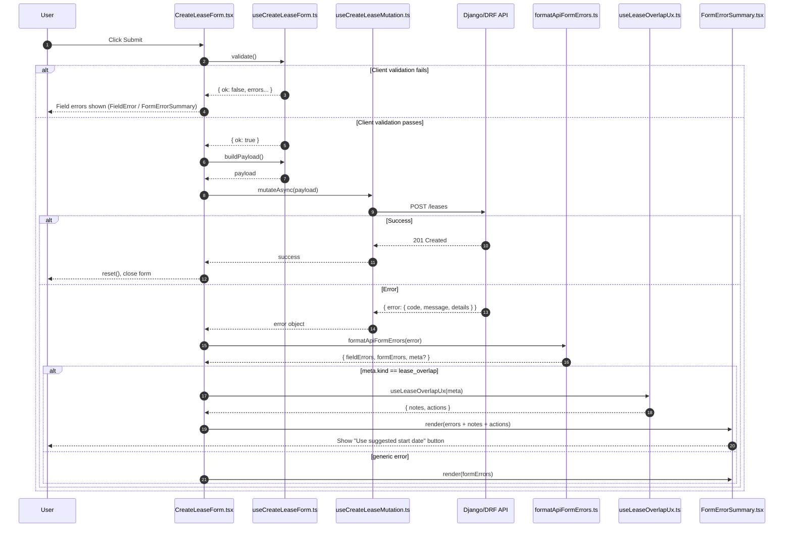

# CreateLeaseForm orchestration & validation map (EstateIQ)

This doc shows how the **Create Lease** UI is wired in EstateIQ and how **validation + API errors** flow through the system.

---

## High-level component map

```mermaid
flowchart TD
  A[CreateLeaseForm.tsx<br/>Orchestrator] --> B[useCreateLeaseForm.ts<br/>Local form state + validation + payload builder]
  A --> C[useCreateLeaseMutation.ts<br/>TanStack mutation (axios)]
  A --> D[formatApiFormErrors.ts<br/>API error -> fieldErrors/formErrors/meta]
  A --> E[useLeaseOverlapUx.ts<br/>meta(lease_overlap) -> notes + actions]
  A --> F[FormErrorSummary.tsx<br/>Renders form-level errors + actions + notes]
  A --> G[LeaseTermsFields.tsx<br/>Presentational fields + FieldError]
  A --> H[TenantSection/*<br/>Select/create tenant UX]
  A --> I[FormActions.tsx<br/>Cancel / Submit]
```

**Design intent**: `CreateLeaseForm.tsx` stays thin and readable, while logic is pushed into well-named helpers/hooks.

---

## What lives where

### CreateLeaseForm.tsx (Orchestrator)
Owns:
- open/close UI state
- submit/cancel orchestration
- mutation state (`isPending`, `error`)
- whether API errors are currently hidden after an auto-fix action (e.g., applying suggested start date)

Delegates:
- form state + payload building -> `useCreateLeaseForm`
- network mutation -> `useCreateLeaseMutation`
- normalization of API errors -> `formatApiFormErrors`
- overlap UX actions/notes -> `useLeaseOverlapUx`
- rendering sections -> `TenantSection`, `LeaseTermsFields`, `FormActions`, `FormErrorSummary`

---

### useCreateLeaseForm.ts (Local state + validation + payload builder)
Owns:
- controlled input state (strings for inputs)
- local (client-side) validation (required fields, basic numeric/date checks)
- `buildPayload()` for the API contract
- tenant selection vs inline creation state (TenantSection)

Outputs to orchestrator:
- `validate()` result
- `buildPayload()` result
- field setters (e.g. `setStartDate`)

---

### useCreateLeaseMutation.ts (Server write)
Owns:
- `mutateAsync(payload)` for POST/CREATE
- org-scoped invalidation and cache refresh (TanStack Query)
- exposes `error` on failure

---

### formatApiFormErrors.ts (Error normalization)
Input: API error envelope from backend:

```json
{
  "error": {
    "code": "...",
    "message": "...",
    "details": { "..." : "..." }
  }
}
```

Output: standardized shape the UI can always render:

```ts
{
  fieldErrors: Record<string, string[]>;
  formErrors: string[];
  meta?: { kind: string; ... } // optional, for rich UX cases like lease_overlap
}
```

This ensures **all forms** can render errors consistently.

---

### FormErrorSummary.tsx (Form-level error box)
Renders:
- `formErrors: string[]` (general form error messages)
- `notes: string[]` (additional explanation lines)
- `actions: FormErrorAction[]` (buttons like “Use suggested start date”)

This is where “smart error UX” becomes reusable across forms.

---

### useLeaseOverlapUx.ts (lease_overlap meta -> UX)
Input: `meta` for lease overlap:

```json
{
  "kind": "lease_overlap",
  "conflict": {
    "lease_id": 7,
    "start_date": "2026-03-05",
    "end_date": "2026-03-06",
    "status": "ENDED"
  },
  "suggestedStartDate": "2026-03-06"
}
```

Output:
- `errorNotes[]`: status-aware explanation text
- `errorActions[]`:
  - **Use suggested start date** -> updates `start_date`, resets mutation error, hides stale API errors
  - **Review conflicting lease** -> navigates to `/dashboard/leases/:id/ledger?org=...`

---

### LeaseTermsFields.tsx (Presentational fields)
Owns:
- rendering inputs for dates, amounts, due day, deposit, status
- showing field-level error strings under each input (via `FieldError`)

Does *not* own:
- state
- validation
- API orchestration

This is the correct boundary for a “fields component.”

---

## Error / validation flow (happy path + failure path)



---

## The lease overlap UX (why it’s “smart”)

### Backend rule (do not change)
Leases are end-exclusive intervals: **[start_date, end_date)**  
So occupancy includes **start_date** but excludes **end_date**.

### What the UI does with `suggestedStartDate`
When backend returns `suggestedStartDate`:
- UI offers a single-click fix
- applies `start_date = suggestedStartDate`
- clears stale error state (mutation reset)
- hides the previous error block so the user can re-submit immediately

This makes a strict backend rule feel “friendly” without weakening correctness.

---

## Why ~200 lines in CreateLeaseForm is acceptable

A form orchestrator around **150–250 lines** is normal when it:
- coordinates multiple sub-sections (tenant + lease terms + actions)
- handles mutation + error normalization
- wires in “smart error UX” actions

If it grows again, the next *non-fragmenting* extraction is usually:
- move “submit/cancel handlers” + “error normalization” into a small helper hook (e.g., `useCreateLeaseOrchestrator`)
…but you **don’t need that yet**.

---

## Suggested quick conventions (optional)
- Keep all shared form utilities under `src/features/leases/utils/`
- Keep “smart error UX” hooks under `src/features/leases/forms/` (close to the form)
- Keep presentational sections under `src/features/leases/forms/` (or `forms/components/` if you prefer)

---

## File index (for navigation)
- `src/features/leases/forms/CreateLeaseForm.tsx`
- `src/features/leases/forms/useCreateLeaseForm.ts`
- `src/features/leases/forms/useLeaseOverlapUx.ts`
- `src/features/leases/utils/dateFormat.ts`
- `src/features/leases/forms/FormErrorSummary.tsx`
- `src/features/leases/forms/LeaseTermsFields.tsx`
- `src/features/leases/forms/TenantSection/*`
- `src/features/leases/queries/useCreateLeaseMutation.ts`
- `src/api/formatApiFormErrors.ts`
