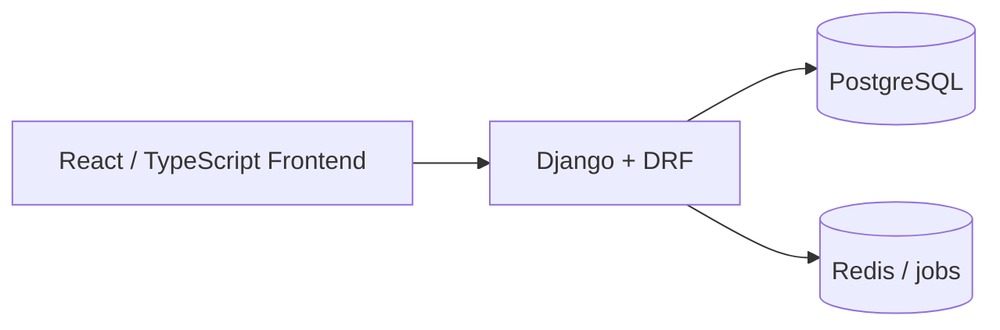
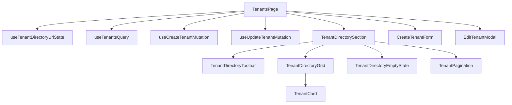
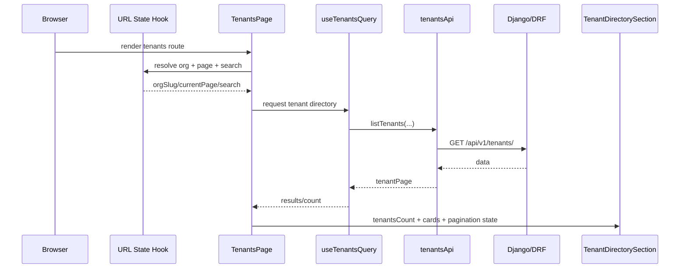

# Tenants Feature Architecture & Engineering Notes

Date: 2026-03-07

## Executive summary

The Tenants feature is a **leasing-domain, org-scoped workspace** built on the PortfolioOS React frontend and backed by a Django + DRF modular monolith. PortfolioOS’s architecture requires hard domain boundaries, org isolation, thin views, and lease-driven occupancy. The tenant feature should therefore be treated as a **directory + workflow launcher**, not just a CRUD list. fileciteturn11file0L5-L6 fileciteturn11file0L26-L44 fileciteturn11file0L70-L80 fileciteturn11file0L97-L116

## System position



This reflects the platform’s documented system architecture and modular monolith approach. fileciteturn11file0L9-L22

## Domain placement

Within the platform’s domain boundaries, tenants belong to **leasing** alongside leases, lease parties, and lease documents. fileciteturn11file0L39-L44

That matters because:

- tenant identity is a leasing-domain concern
- current residence should come from lease state
- any future billing, delinquency, or payment view should link back through the lease lifecycle rather than duplicating tenant state

## Design principles for this feature

### Feature-first frontend structure

The frontend guide recommends a feature-first structure with one Axios client and centralized auth concerns. The tenant feature follows that by grouping its API, hooks, pages, forms, and components in one domain folder. fileciteturn11file5L56-L61

### Minimal tenant data

Compliance guidance says to store tenant name and contact data, while avoiding unnecessary sensitive identifiers. The create form implementation also reinforces that the feature currently stores name plus contact info only. fileciteturn11file4L9-L19 fileciteturn11file14L39-L47

### Lease-driven occupancy

The system explicitly rejects manual occupancy flags and instead derives occupancy from active leases. This should remain the basis for all tenant-assignment UI. fileciteturn11file0L97-L103 fileciteturn11file6L12-L18

## Route architecture

Current route page responsibilities are documented directly in `TenantsPage`: it reads org/page/search, fetches paginated tenant data, owns create/edit UI state, launches tenant-driven lease creation, and delegates layout to child components. fileciteturn11file1L53-L63

### Route orchestration diagram



## Component contract map

### `TenantsPage`

**Owns**

- route/search/page state
- query and mutation hooks
- form open/close state
- view/edit/create-lease actions

**Does not own**

- grid layout internals
- toolbar rendering details
- pagination rendering details
- card presentation logic

### `TenantDirectorySection`

**Owns**

- section shell
- header and count
- composition of toolbar, grid, empty state, and pagination

**Does not own**

- fetches
- mutations
- route state

### `TenantCard`

**Owns**

- tenant identity presentation
- card actions
- composition of status/contact/residence summary pieces

### `CreateTenantForm`

The create form is stateful and performs local UI validation. It surfaces parent-supplied API errors, but does not call APIs directly. fileciteturn11file14L65-L80

### `EditTenantModal`

The edit modal is presentational and controlled by the parent page. It also communicates an important domain rule: residence history is lease-driven, not edited directly on the tenant record. fileciteturn11file15L19-L33 fileciteturn11file15L83-L90

## Sequence: page load to cards render



## Current implementation notes

### Create flow

The page opens a hidden-by-default create flow through `isCreateOpen`, then passes `isSaving`, `errorMessage`, `onSubmit`, and `onCancel` down to `CreateTenantForm`. That form uses local validation rules and normalizes optional email/phone values before submission. fileciteturn11file14L12-L17 fileciteturn11file14L26-L32 fileciteturn11file14L48-L63

### Edit flow

The page opens `EditTenantModal`, seeds it from the selected tenant, and submits a PATCH-style payload with normalized optional text fields.

### Lease launch

The route-to-route connection is:

```text
TenantsPage -> /dashboard/leases/new?org=<slug>&tenantId=<id>
```

That makes the tenant directory operational, not passive. fileciteturn11file9L3-L6

## Known architecture cleanup area

Some uploaded files still show older copies of the tenant feature, including:

- flat array query hook contracts
- older tenant types without active lease summary
- older section component props (`renderTenants`, `isAddOpen`, `addForm`)

These older copies are useful for historical context, but they should not define the final architecture going forward. Compare the older hook and section files with the target orchestration shape used by the current page. fileciteturn11file10L25-L35 fileciteturn11file10L39-L52 fileciteturn11file11L19-L29 fileciteturn11file1L87-L99

## Recommended target API contract

For a stable tenant directory, the list endpoint should evolve toward a paginated envelope similar to:

```json
{
  "count": 37,
  "next": "...",
  "previous": null,
  "results": [
    {
      "id": 12,
      "full_name": "Rebecca Lalchan",
      "email": "rebecca@gmail.com",
      "phone": "555-555-554",
      "active_lease": {
        "id": 44,
        "status": "active",
        "start_date": "2026-01-01",
        "building": { "id": 3, "label": "Ocean View" },
        "unit": { "id": 9, "label": "2A" }
      },
      "created_at": "...",
      "updated_at": "..."
    }
  ]
}
```

Why this shape:

- it preserves minimal tenant identity at the root
- it nests lease-derived operational context under `active_lease`
- it supports card rendering, detail pages, and future analytics surfaces cleanly

## Frontend state ownership table

| Concern | Owner |
|---|---|
| org/page/search | `useTenantDirectoryUrlState` |
| tenant list fetch | `useTenantsQuery` |
| create mutation | `useCreateTenantMutation` |
| update mutation | `useUpdateTenantMutation` |
| create form local field state | `CreateTenantForm` |
| edit modal controlled field state | `TenantsPage` + `EditTenantModal` |
| search input UI | `TenantDirectoryToolbar` |
| card rendering | `TenantCard` |
| pagination controls | `TenantPagination` |

## Recommended tests

The project’s contributing guide and dev guide both emphasize org scoping, no N+1 queries, tests for critical behavior, and mobile verification. The tenant feature should have at least these tests: fileciteturn11file2L27-L33 fileciteturn11file5L44-L52 fileciteturn11file5L78-L83

### Backend

- tenant list is org-scoped
- tenant create rejects missing full name
- tenant create rejects missing both email and phone
- tenant list search only returns same-org matches
- tenant directory list avoids N+1 for active lease summaries

### Frontend

- opening create form does not pre-populate a false error
- stale page query params get clamped back to a valid page
- search input syncs to URL after debounce
- edit modal seeds the selected tenant correctly
- create and update invalidate org tenant list queries

## Future roadmap alignment

The 90-day roadmap places Tenants CRUD and Leases CRUD in the leasing phase, with occupancy correctness as the phase exit condition. That makes this feature foundational for everything that follows in billing, delinquency, and reporting. fileciteturn11file13L33-L42

The product spec also makes year-end exports, delinquency views, and clean landlord workflows core to the product. That means tenant identity and lease relationships need to stay deterministic and trustworthy now, not later. fileciteturn11file16L29-L57

## Suggested next evolution

1. **Tenant profile page**
   - identity
   - active lease
   - lease history
   - payments / charges later
   - notes/documents later

2. **Async tenant select**
   - replace a large dropdown with search-as-you-type once tenant count grows

3. **Backend active-lease summary**
   - make the card display real occupancy context instead of fallback-only states

4. **Create flow presentation refinement**
   - reveal the create form inline under the toolbar or as a true collapsible panel instead of a large surface above the grid

## Bottom line

The tenant feature is already on the right architecture path:

- route orchestrator page
- feature-first folder structure
- reusable directory shell
- focused form/modal components
- org-scoped leasing workflows

The remaining work is mostly contract hardening and workflow deepening, not a structural rewrite.
