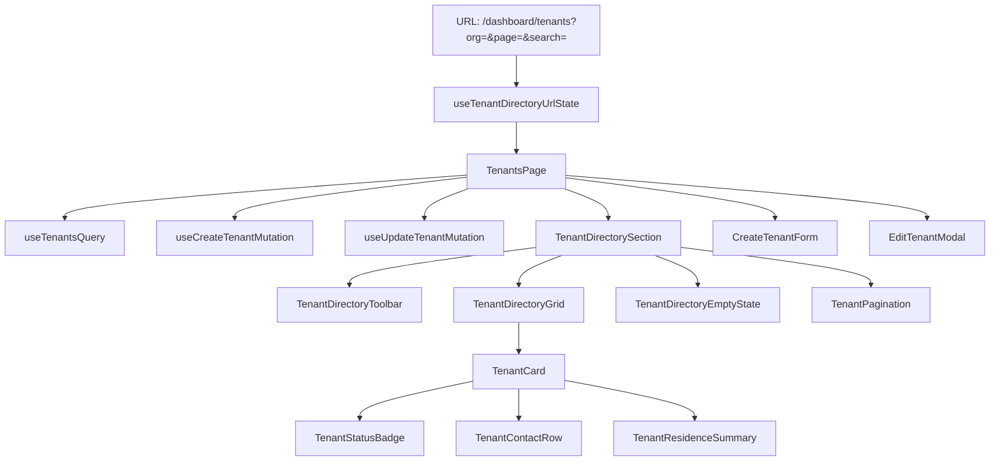
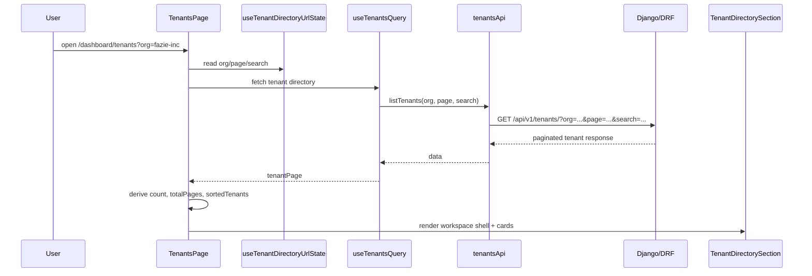
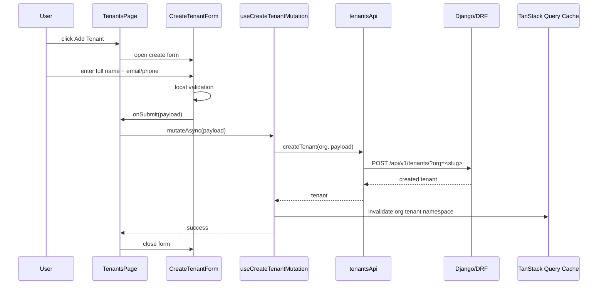
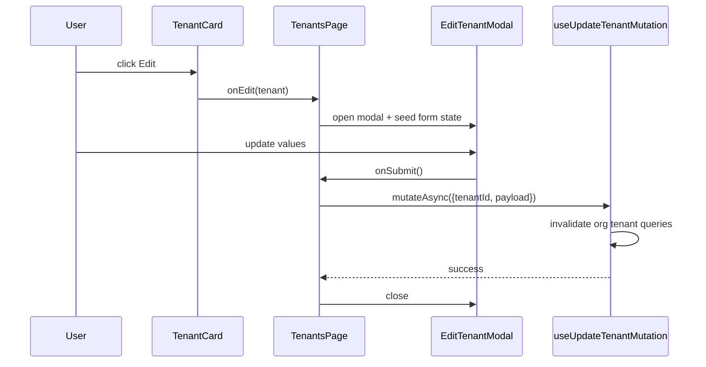

# Tenants Feature Overview — PortfolioOS / EstateIQ

Date: 2026-03-07

## Purpose

The **Tenants** feature is the leasing-domain workspace for creating, searching, editing, and selecting reusable tenant records inside an organization-scoped PortfolioOS account. It exists to support the broader leasing model, where **occupancy is derived from active leases**, not from a mutable boolean stored on a unit or tenant. The broader product architecture defines PortfolioOS as a modular monolith with strict org scoping, and it explicitly states that a unit is occupied if it has an active lease. fileciteturn11file0L5-L6 fileciteturn11file0L70-L80 fileciteturn11file0L97-L103

At the product level, Tenants CRUD and Leases CRUD are part of the leasing MVP, and the product spec calls out mobile-friendly, low-cognitive-load workflows as a UX goal. fileciteturn11file13L33-L42 fileciteturn11file16L36-L40 fileciteturn11file16L71-L76

## What this feature does

The current tenant workspace is centered on a route-level `TenantsPage` that:

- resolves org, page, and search state from the URL-backed directory hook
- fetches the tenant directory through TanStack Query
- owns create/edit UI state
- launches tenant-driven lease creation at `/dashboard/leases/new?org=<slug>&tenantId=<id>`
- delegates layout to feature components instead of doing everything in the page file fileciteturn11file1L53-L63

The create form intentionally stores only minimal tenant identity/contact information. The current form contract enforces:

- `full_name` is required
- at least one contact method is required (`email` or `phone`) 
- backend validation must still enforce the real rule even if the form performs UI validation first fileciteturn11file14L35-L47 fileciteturn11file14L48-L63

That aligns with the compliance guidance for tenant data minimization: only store what is needed to operate, avoid unnecessary sensitive information, and keep access org-isolated. fileciteturn11file4L9-L19 fileciteturn11file4L31-L35

## Core product rules

### 1. Tenant is a first-class record

A tenant should exist independently of a unit assignment so the same record can be reused across lease workflows, history, and future billing/reporting surfaces.

### 2. Residence is lease-derived

Do **not** store current building or unit as mutable tenant-owned truth. The system architecture and product docs make occupancy lease-driven, not manually flagged. fileciteturn11file0L97-L103 fileciteturn11file6L44-L55

### 3. Every request is organization-scoped

The platform’s multi-tenancy strategy requires org-scoped querysets and `Organization` isolation from day one. fileciteturn11file0L70-L80 fileciteturn11file6L44-L55

### 4. The feature must stay mobile-friendly

PortfolioOS explicitly targets clear, fast workflows with low cognitive load and mobile-friendly UX. fileciteturn11file16L71-L76

## Current route and UX surface

The tenant workspace currently presents:

- a hero/introduction surface describing the tenant directory
- an org badge and back-to-dashboard action
- a searchable tenant directory shell
- a hidden-by-default create flow opened from **Add Tenant**
- tenant cards with view, edit, and create-lease actions
- pagination controls for paginated list results

The page itself is intended to be an orchestrator, not a giant presentational file. fileciteturn11file1L53-L63

## Feature folder structure

Recommended/target structure for the tenant feature:

```text
src/features/tenants/
├── api/
│   ├── tenantsApi.ts
│   └── types.ts
│
├── components/
│   ├── cards/
│   │   └── TenantCard.tsx
│   ├── directory/
│   │   ├── TenantDirectoryEmptyState.tsx
│   │   ├── TenantDirectoryGrid.tsx
│   │   ├── TenantDirectorySection.tsx
│   │   ├── TenantDirectoryToolbar.tsx
│   │   └── TenantPagination.tsx
│   ├── selectors/
│   │   └── TenantSelect.tsx
│   └── shared/
│       ├── TenantContactRow.tsx
│       ├── TenantResidenceSummary.tsx
│       └── TenantStatusBadge.tsx
│
├── forms/
│   ├── CreateTenantForm.tsx
│   └── EditTenantModal.tsx
│
├── hooks/
│   ├── useCreateTenantMutation.ts
│   ├── useTenantDirectoryUrlState.ts
│   ├── useTenantsQuery.ts
│   └── useUpdateTenantMutation.ts
│
├── pages/
│   └── TenantsPage.tsx
│
├── utils/
│   └── tenantQueryKeys.ts
│
└── index.ts
```

This structure also matches the broader frontend guidance for a feature-first React codebase. fileciteturn11file5L56-L61

## Frontend orchestration diagram



## Frontend responsibilities

### `TenantsPage`

`TenantsPage` is the route orchestrator. It owns:

- URL-backed directory state
- TanStack Query wiring
- create/edit open state
- lease-launch navigation
- guard behavior when org context is missing fileciteturn11file1L53-L63

### `TenantDirectorySection`

The directory section is the workspace shell. Its job is to compose:

- header and tenant count
- toolbar
- loading/error/empty states
- grid rendering
- pagination

It should not fetch, mutate, or resolve org state.

### `TenantCard`

The card is the operational unit of the directory. It should answer:

- who is this tenant?
- how can I contact them?
- do they have an active lease?
- where are they assigned?
- what is the next action?

### `CreateTenantForm`

The create form owns local input state and UI validation. It intentionally does **not** own API mutation execution or query invalidation. fileciteturn11file14L65-L80

### `EditTenantModal`

The edit modal is presentational and controlled by the page. It renders controlled fields, blocks unsafe close while saving, and reminds the user that tenant residence history is lease-driven, not manually edited on the tenant record. fileciteturn11file15L19-L33 fileciteturn11file15L83-L90

## Data flow diagram



## Create-tenant flow



## Edit-tenant flow



## Lease-launch flow

The directory is also a launch point into the leasing workflow:

```text
/dashboard/leases/new?org=<slug>&tenantId=<id>
```

The current page already performs tenant-driven lease launch this way, which keeps the tenant directory operational instead of being CRUD-only. fileciteturn11file9L3-L6

## Current UI strengths

From the current UI state, the feature is already doing several things well:

- strong top-level hierarchy with a clear hero surface
- scan-friendly cards instead of a cramped table
- obvious primary action for lease creation
- good dark workspace styling consistent with the app shell
- count badge + search input + add action grouped in a recognizable directory pattern

## Current refinement opportunities

### 1. Inline create panel placement

The create form currently lives above the directory when opened. A more polished pattern would be to reveal it directly under the directory toolbar or as a true dropdown/collapsible panel so the feature feels tighter and causes less vertical shift.

### 2. More explicit active-lease visual language

Once the backend summary shape includes active lease/building/unit data consistently, the card should move from “No Active Lease” / residence fallback to a stronger assigned-state presentation.

### 3. Search and pagination contract hardening

The long-term feature should use a real paginated response shape and canonical cache keys for page/search variants. Some uploaded file copies still show older flat-array contracts, so this should be treated as an active cleanup area rather than “done.” Compare the older flat query hook and older flat tenant type with the target page orchestration. fileciteturn11file10L25-L35 fileciteturn11file10L39-L52 fileciteturn11file7L15-L22

## Rules that should remain true as the feature grows

- Tenant identity stays minimal.
- Lease history, not tenant mutation, determines residence history.
- All list and mutation behavior remains org-scoped.
- The page remains an orchestrator, not a mega-component.
- The feature remains mobile-friendly and card-first until scale truly justifies a table view.

## Recommended future additions

- `TenantProfilePage` with lease history, payments, notes, and documents
- lightweight async tenant picker endpoint for lease forms once tenant counts grow
- server-side active lease summary on directory results
- stronger empty states for first-record vs filtered-empty cases
- tests around org scoping, query invalidation, and URL state behavior

These recommendations align with the PortfolioOS leasing roadmap and the broader production-grade code review checklist that requires org scoping, no N+1 list endpoints, and verified mobile UI. fileciteturn11file13L33-L42 fileciteturn11file2L27-L33
